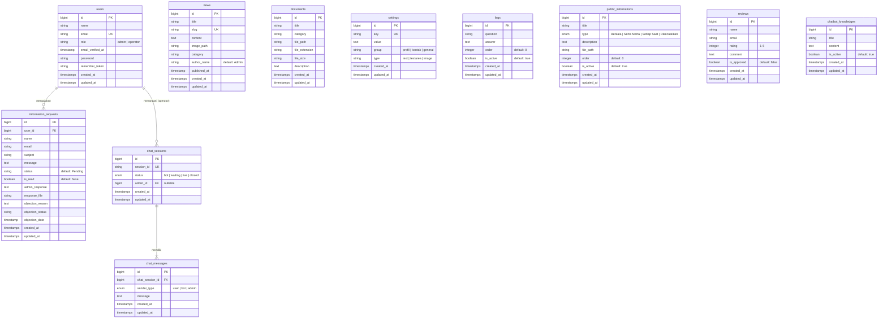

# 📘 Dokumentasi Website PPID Kemenag Sumenep

> Portal Resmi Layanan Informasi dan Dokumentasi Kementerian Agama Kabupaten Sumenep

---

## 📋 Daftar Isi

1. [Gambaran Umum](#-gambaran-umum)
2. [Tech Stack](#-tech-stack)
3. [Struktur Direktori](#-struktur-direktori)
4. [Role & Autentikasi](#-role--autentikasi)
5. [Fitur Website](#-fitur-website)
6. [Skema Database](#-skema-database)
7. [Routing](#-routing)
8. [Middleware](#-middleware)
9. [Layout & Views](#-layout--views)
10. [Integrasi Pihak Ketiga](#-integrasi-pihak-ketiga)
11. [Konfigurasi Environment](#-konfigurasi-environment)
12. [Cara Menjalankan](#-cara-menjalankan)
13. [Akun Default](#-akun-default)

---

## 🌐 Gambaran Umum

Website ini merupakan **Portal PPID (Pejabat Pengelola Informasi dan Dokumentasi)** untuk Kementerian Agama Kabupaten Sumenep. Website ini menyediakan layanan informasi publik secara online, termasuk permohonan informasi, pengelolaan berita, dokumen publik, chatbot AI, dan live chat dengan operator Customer Service.

---

## 🛠 Tech Stack

### Backend
| Teknologi | Versi | Keterangan |
|---|---|---|
| **PHP** | ^8.3 | Bahasa pemrograman utama |
| **Laravel** | ^13.7 | Framework PHP |
| **MySQL** | - | Database relasional |
| **Laravel Tinker** | ^3.0 | REPL untuk debugging |

### Frontend
| Teknologi | Versi | Keterangan |
|---|---|---|
| **Blade** | - | Template engine bawaan Laravel |
| **Tailwind CSS** | ^4.0 | Utility-first CSS framework |
| **Vite** | ^8.0 | Build tool & dev server |
| **Lucide Icons** | Latest | Icon library |
| **AOS (Animate On Scroll)** | 2.3.1 | Library animasi scroll |
| **Marked.js** | Latest | Markdown parser (untuk chatbot) |
| **Google Fonts (Inter)** | - | Tipografi |

### Integrasi Eksternal
| Layanan | Keterangan |
|---|---|
| **Groq API** | AI Chatbot (model: `llama-3.1-8b-instant`) |
| **WhatsApp API** | Tombol floating chat WhatsApp |

---

## 📁 Struktur Direktori

```
ppid_kemenag_sumenep/
├── app/
│   ├── Http/
│   │   ├── Controllers/
│   │   │   ├── AdminController.php          # Dashboard, settings, reviews
│   │   │   ├── AdminChatbotKnowledgeController.php  # Knowledge base chatbot
│   │   │   ├── AdminDocumentController.php  # CRUD dokumen
│   │   │   ├── AdminFaqController.php       # CRUD FAQ
│   │   │   ├── AdminLiveChatController.php  # Live chat operator
│   │   │   ├── AdminNewsController.php      # CRUD berita
│   │   │   ├── AdminProfileController.php   # Profil & keamanan akun
│   │   │   ├── AdminPublicInformationController.php # CRUD DIP
│   │   │   ├── AdminRequestController.php   # Manajemen permohonan
│   │   │   ├── AuthController.php           # Login, register, logout
│   │   │   ├── ChatbotController.php        # AI Chatbot + handoff CS
│   │   │   ├── PublicController.php         # Semua halaman publik
│   │   │   └── UserController.php           # (Legacy)
│   │   └── Middleware/
│   │       └── CheckRole.php                # Role-based access control
│   └── Models/
│       ├── ChatMessage.php
│       ├── ChatSession.php
│       ├── ChatbotKnowledge.php
│       ├── Document.php
│       ├── Faq.php
│       ├── InformationRequest.php
│       ├── News.php
│       ├── PublicInformation.php
│       ├── Review.php
│       ├── Setting.php
│       └── User.php
├── database/
│   ├── migrations/        # 14 file migrasi
│   └── seeders/
│       └── DatabaseSeeder.php
├── resources/views/
│   ├── admin/             # Panel admin (dashboard, CRUD)
│   ├── auth/              # Login & register
│   ├── documents/         # Halaman dokumen publik
│   ├── layouts/           # Layout templates
│   │   ├── admin.blade.php
│   │   ├── app.blade.php       # Layout publik utama
│   │   ├── operator.blade.php  # Layout operator CS
│   │   └── user.blade.php      # (Legacy)
│   ├── news/              # Halaman berita
│   ├── pages/             # Halaman statis (profil, FAQ, dll)
│   ├── requests/          # Form permohonan informasi
│   └── home.blade.php     # Halaman beranda
└── routes/
    └── web.php            # Definisi semua route
```

---

## 👥 Role & Autentikasi

Sistem menggunakan **Role-Based Access Control (RBAC)** sederhana dengan 2 role aktif:

| Role | Akses | Redirect Setelah Login |
|---|---|---|
| **Admin** | Dashboard admin, manajemen konten (berita, dokumen, DIP, FAQ), pengaturan website, moderasi ulasan, manajemen permohonan informasi, knowledge base chatbot | `/admin/dashboard` |
| **Operator** | Dashboard Live Chat khusus, menerima dan membalas pesan dari pengunjung yang di-escalate dari chatbot AI | `/operator/livechat` |

### Middleware `CheckRole`

```php
// Penggunaan di route:
->middleware('role:admin')       // Hanya admin
->middleware('role:operator')    // Hanya operator
->middleware('role:admin,operator') // Admin atau operator
```

Jika user tidak memiliki role yang sesuai, akan muncul **HTTP 403 Forbidden**.

---

## ✨ Fitur Website

### A. Fitur Publik (Pengunjung)

| # | Fitur | URL | Keterangan |
|---|---|---|---|
| 1 | **Beranda** | `/` | Hero section, berita terbaru, akses cepat |
| 2 | **Profil PPID** | `/profil-ppid` | Visi, misi, struktur organisasi |
| 3 | **Standar Layanan** | `/prosedur-layanan` | Prosedur permohonan informasi |
| 4 | **PPID Info** | `/ppid-info` | Daftar dokumen yang dipublikasikan |
| 5 | **Berita** | `/news` | Daftar berita & artikel |
| 6 | **Detail Berita** | `/news/{slug}` | Isi lengkap berita |
| 7 | **Kontak** | `/kontak` | Informasi kontak & lokasi |
| 8 | **FAQ** | `/faq` | Pertanyaan yang sering diajukan |
| 9 | **Statistik** | `/statistik` | Data statistik PPID |
| 10 | **Pencarian** | `/search?q=...` | Pencarian global |
| 11 | **DIP** | `/daftar-informasi-publik` | Daftar Informasi Publik (4 kategori) |
| 12 | **Ulasan** | `/ulasan` | Beri & lihat ulasan pengunjung |
| 13 | **Permohonan Informasi** | `/permohonan-informasi` | Form pengajuan permohonan |
| 14 | **Cek Status** | `/cek-status` | Lacak status permohonan |
| 15 | **Chatbot AI** | Widget floating | Asisten virtual berbasis Gemini AI |
| 16 | **WhatsApp** | Tombol floating | Link langsung ke WhatsApp |

### B. Fitur Chatbot AI

- Chatbot menggunakan **Groq API** dengan model **Llama 3.1 8B Instant** sebagai backend AI
- Format request menggunakan **OpenAI-compatible API** (`/openai/v1/chat/completions`)
- Mendukung **Markdown rendering** pada respon bot
- Fitur **escalation/handoff** ke CS manusia jika pengunjung mengetik "Hubungi CS"
- **Knowledge Base** yang bisa dikelola admin untuk memperkaya konteks AI
- **Polling-based real-time** messaging (interval 3 detik)
- Notifikasi suara **satu kali** saat pertama terhubung ke CS
- Sesi chat menggunakan `localStorage` di browser

### C. Fitur Admin Panel

| # | Fitur | Keterangan |
|---|---|---|
| 1 | **Dashboard** | Ringkasan statistik website |
| 2 | **Manajemen Berita** | CRUD berita dengan upload gambar, kategori, SEO slug |
| 3 | **Manajemen Dokumen** | Upload & kelola dokumen publik |
| 4 | **Manajemen DIP** | CRUD Daftar Informasi Publik (Berkala, Serta Merta, Setiap Saat, Dikecualikan) |
| 5 | **Manajemen FAQ** | CRUD pertanyaan umum dengan urutan & status aktif |
| 6 | **Knowledge Base Chatbot** | Kelola referensi pengetahuan untuk AI chatbot |
| 7 | **Permohonan Informasi** | Lihat, respon, dan update status permohonan |
| 8 | **Moderasi Ulasan** | Approve atau hapus ulasan dari pengunjung |
| 9 | **Pengaturan Umum** | Edit info kontak, nomor WhatsApp, dll (key-value) |
| 10 | **Profil & Keamanan** | Ubah password, lihat info sesi |

### D. Fitur Operator Panel

| # | Fitur | Keterangan |
|---|---|---|
| 1 | **Antrean Live Chat** | Daftar sesi chat yang menunggu/aktif |
| 2 | **Balas Pesan** | Interface chat real-time untuk membalas pengunjung |
| 3 | **Tutup Sesi** | Menutup/menyelesaikan sesi chat |
| 4 | **Polling Pesan** | Auto-refresh pesan baru dari pengunjung |

---

## 🗄 Skema Database

### Entity Relationship Diagram



### Ringkasan Tabel

| # | Tabel | Jumlah Kolom | Keterangan |
|---|---|---|---|
| 1 | `users` | 8 | Akun admin & operator |
| 2 | `news` | 9 | Berita & artikel |
| 3 | `documents` | 8 | Dokumen yang bisa diunduh |
| 4 | `information_requests` | 14 | Permohonan informasi publik |
| 5 | `settings` | 6 | Pengaturan website (key-value) |
| 6 | `faqs` | 6 | Pertanyaan yang sering diajukan |
| 7 | `public_informations` | 8 | Daftar Informasi Publik (DIP) |
| 8 | `reviews` | 7 | Ulasan & rating pengunjung |
| 9 | `chatbot_knowledges` | 5 | Knowledge base untuk AI |
| 10 | `chat_sessions` | 5 | Sesi percakapan chatbot/live chat |
| 11 | `chat_messages` | 5 | Pesan dalam sesi chat |
| 12 | `sessions` | 5 | Session management Laravel |
| 13 | `password_reset_tokens` | 3 | Token reset password |
| 14 | `cache` | - | Cache Laravel |
| 15 | `jobs` | - | Queue jobs Laravel |

### Foreign Key Relationships

```
information_requests.user_id → users.id (nullable, nullOnDelete)
chat_sessions.admin_id → users.id (nullable, nullOnDelete)
chat_messages.chat_session_id → chat_sessions.id (cascadeOnDelete)
sessions.user_id → users.id (nullable)
```

---

## 🔀 Routing

### Public Routes

| Method | URI | Controller@Method | Name |
|---|---|---|---|
| GET | `/` | PublicController@home | `home` |
| GET | `/profil-ppid` | PublicController@profil | `profil.index` |
| GET | `/prosedur-layanan` | PublicController@prosedur | `prosedur.index` |
| GET | `/ppid-info` | PublicController@ppidInfo | `documents.index` |
| GET | `/news` | PublicController@indexNews | `news.index` |
| GET | `/news/{slug}` | PublicController@newsDetail | `news.show` |
| GET | `/kontak` | PublicController@kontak | `kontak.index` |
| GET | `/faq` | PublicController@faq | `faq.index` |
| GET | `/statistik` | PublicController@statistik | `statistik.index` |
| GET | `/search` | PublicController@search | `search` |
| GET | `/daftar-informasi-publik` | PublicController@dip | `dip.index` |
| GET | `/ulasan` | PublicController@reviews | `reviews.index` |
| POST | `/ulasan` | PublicController@submitReview | `reviews.store` |
| GET | `/permohonan-informasi` | PublicController@requestForm | `requests.create` |
| POST | `/permohonan-informasi` | PublicController@submitRequest | `requests.store` |
| GET | `/permohonan-informasi/success/{id}` | PublicController@success | `requests.success` |
| GET | `/permohonan-informasi/receipt/{id}` | PublicController@receipt | `requests.receipt` |
| GET | `/cek-status` | PublicController@trackRequest | `requests.track` |

### Auth Routes

| Method | URI | Name |
|---|---|---|
| GET | `/login` | `login` |
| POST | `/login` | - |
| GET | `/register` | `register` |
| POST | `/register` | - |
| POST | `/logout` | `logout` |

### Chatbot Routes (Tanpa Auth)

| Method | URI | Name |
|---|---|---|
| POST | `/chatbot/chat` | `chatbot.chat` |
| GET | `/chatbot/poll` | `chatbot.poll` |

### Operator Routes (`auth` + `role:operator`)

| Method | URI | Name |
|---|---|---|
| GET | `/operator/livechat` | `operator.livechat.index` |
| GET | `/operator/livechat/{session}` | `operator.livechat.show` |
| POST | `/operator/livechat/{session}/reply` | `operator.livechat.reply` |
| POST | `/operator/livechat/{session}/close` | `operator.livechat.close` |
| GET | `/operator/livechat/{session}/poll` | `operator.livechat.poll` |

### Admin Routes (`auth` + `role:admin`)

| Method | URI | Name |
|---|---|---|
| GET | `/admin/dashboard` | `admin.dashboard` |
| GET | `/admin/profile` | `admin.profile.index` |
| GET | `/admin/profile/session-info` | `admin.profile.session` |
| PUT | `/admin/profile/password` | `admin.profile.password` |
| Resource | `/admin/news` | `admin.news.*` |
| Resource | `/admin/documents` | `admin.documents.*` |
| Resource | `/admin/dip` | `admin.dip.*` |
| Resource | `/admin/faqs` | `admin.faqs.*` |
| Resource | `/admin/chatbot_knowledge` | `admin.chatbot_knowledge.*` (except show) |
| GET | `/admin/settings` | `admin.settings.index` |
| PUT | `/admin/settings/general` | `admin.settings.general` |
| GET | `/admin/reviews` | `admin.reviews.index` |
| PUT | `/admin/reviews/{review}/approve` | `admin.reviews.approve` |
| DELETE | `/admin/reviews/{review}` | `admin.reviews.destroy` |
| Resource | `/admin/requests` | `admin.requests.*` (index, show, update) |

---

## 🛡 Middleware

| Middleware | File | Keterangan |
|---|---|---|
| `auth` | Laravel built-in | Memastikan user sudah login |
| `role:{roles}` | `app/Http/Middleware/CheckRole.php` | Memvalidasi role user. Menerima satu atau lebih role dipisahkan koma |

---

## 🎨 Layout & Views

| Layout | File | Digunakan Oleh |
|---|---|---|
| **Public** | `layouts/app.blade.php` | Semua halaman publik (beranda, berita, profil, dll) |
| **Admin** | `layouts/admin.blade.php` | Dashboard & panel admin |
| **Operator** | `layouts/operator.blade.php` | Panel live chat operator (tema biru) |

### Komponen UI Publik

- **Navigasi**: Responsive navbar dengan menu desktop & mobile
- **Chatbot Widget**: Floating button + chat window dengan AI
- **WhatsApp Button**: Floating button di pojok kanan bawah
- **Footer**: 4 kolom (info, tautan, layanan, kontak)

---

## 🔗 Integrasi Pihak Ketiga

### 1. Groq AI (Llama 3.1)

- **Provider**: Groq Cloud
- **Model**: `llama-3.1-8b-instant` (bisa diganti via `GROQ_MODEL` di `.env`)
- **Endpoint**: `https://api.groq.com/openai/v1/chat/completions`
- **Auth**: Bearer token (`GROQ_API_KEY`)
- **Fungsi**: Menjawab pertanyaan pengunjung seputar PPID
- **Fitur**: Context-aware (membaca knowledge base + riwayat 10 pesan terakhir)
- **Parameter**: `temperature: 0.3`, `max_tokens: 512`
- **Konfigurasi**: `GROQ_API_KEY` dan `GROQ_MODEL` di file `.env`

### 2. WhatsApp

- **Implementasi**: Link `wa.me` dengan pesan template
- **Nomor**: Dikonfigurasi via Settings (`kontak_wa`)

---

## ⚙ Konfigurasi Environment

Variabel penting di file `.env`:

```env
# Database
DB_CONNECTION=mysql
DB_HOST=127.0.0.1
DB_PORT=3306
DB_DATABASE=ppidsumenep
DB_USERNAME=admin
DB_PASSWORD=xxxxxx

# Session
SESSION_DRIVER=database

# AI Chatbot (Groq)
GROQ_API_KEY=your_groq_api_key_here
GROQ_MODEL=llama-3.1-8b-instant
```

---

## 🚀 Cara Menjalankan

```bash
# 1. Install dependencies
composer install
npm install

# 2. Copy environment file
cp .env.example .env
php artisan key:generate

# 3. Konfigurasi database di .env lalu jalankan migrasi
php artisan migrate

# 4. Seed akun default
php artisan db:seed

# 5. Jalankan development server
php artisan serve    # Backend di http://127.0.0.1:8000
npm run dev          # Vite dev server

# Atau gunakan shortcut:
composer dev         # Jalankan semua sekaligus
```

---

## 🔑 Akun Default

| Role | Email | Password |
|---|---|---|
| **Admin** | `admin@ppid.com` | `password` |
| **Operator** | `operator@ppid.com` | `password` |

> ⚠️ **Penting**: Segera ganti password default setelah deployment ke production!

---

## 📊 Alur Chatbot & Live Chat

```
┌─────────────┐     Kirim Pesan      ┌──────────────┐
│  Pengunjung  │ ──────────────────►  │  ChatBot AI  │
│  (Browser)   │ ◄──────────────────  │  (Gemini)    │
└─────────────┘     Balasan AI       └──────────────┘
       │                                      │
       │  Ketik "Hubungi CS"                  │
       ▼                                      ▼
┌─────────────┐                      ┌──────────────┐
│  Status:    │     Polling (3s)     │   Operator   │
│  "waiting"  │ ◄──────────────────► │  Dashboard   │
│  → "live"   │     Balas Pesan      │  (CS Panel)  │
└─────────────┘                      └──────────────┘
       │                                      │
       │  Operator tutup sesi                 │
       ▼                                      ▼
┌─────────────┐                      ┌──────────────┐
│  Status:    │                      │   Sesi       │
│  "closed"   │                      │   Selesai    │
└─────────────┘                      └──────────────┘
```

### Status Sesi Chat

| Status | Keterangan |
|---|---|
| `bot` | Ditangani oleh AI chatbot |
| `waiting` | Menunggu operator mengambil alih |
| `live` | Sedang dalam percakapan dengan operator |
| `closed` | Sesi telah ditutup |

---

*Dokumentasi ini terakhir diperbarui pada: **28 Juni 2026***
*Dibuat oleh: Syawqi Developer*
